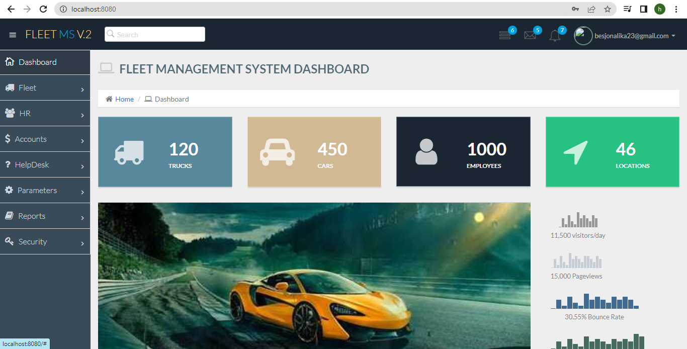

# Fleet Management Application

Help its user to manage their fleets in a simple and effective way, resulting in a clear increase in productivity, margins and quality of service.

## Tech Stack

**Client:** JavaScript, HTML, CSS, Bootstrap

**Server:** Java, Spring MVC, Spring Security, Spring Data JPA,Hibernate ORM, MySQL Database

## Steps

1. Create the project in https://start.spring.io/  adding the following dependencies:

- lombok: Helps to generate POJO code
- mysql-connector-jave: Manages connection to MySQL database
- spring-boot-starter-web: Functionality for web applications created in Spring Boot
- spring-boot-starter-data-jpa: Helps handling data access.
- spring-boot-starter-thymeleaf: Template engine for rendering html pages
- spring-boot-starter-security: Handles user login, authentication and authorization.

2. The package structure will be :

- controller
- service
- repository
- models

3. Configuration for MySql datavbase in the application.properties file

spring.datasource.driver-class-name=com.mysql.cj.jdbc.Driver
spring.datasource.password=root
spring.datasource.username=root
spring.datasource.url=jdbc:mysql://localhost:3301/fleetdb?serverTimezone=UTC
spring.jpa.hibernate.ddl-auto=update

4. The template of this application will be downloaded fron this link :
   https://bootstrapmade.com/nice-admin-bootstrap-admin-html-template/

## Screenshots 

